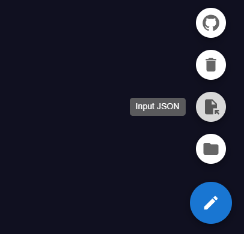
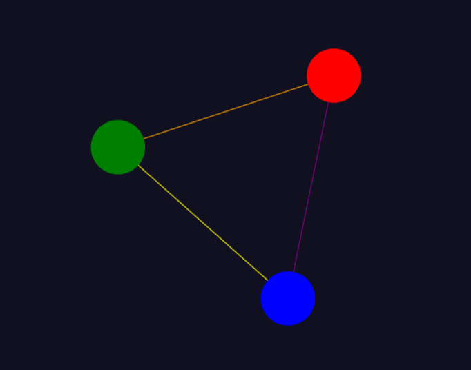
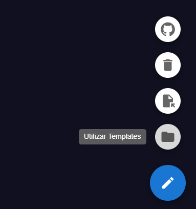
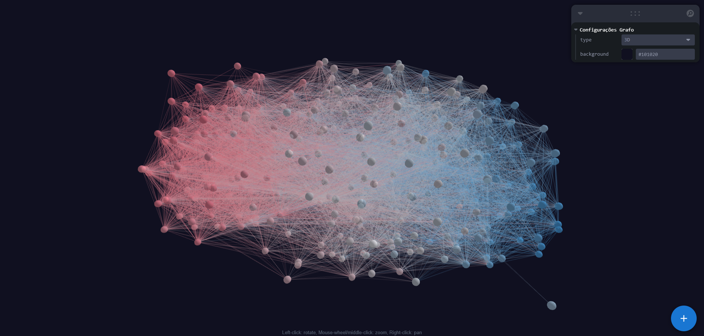
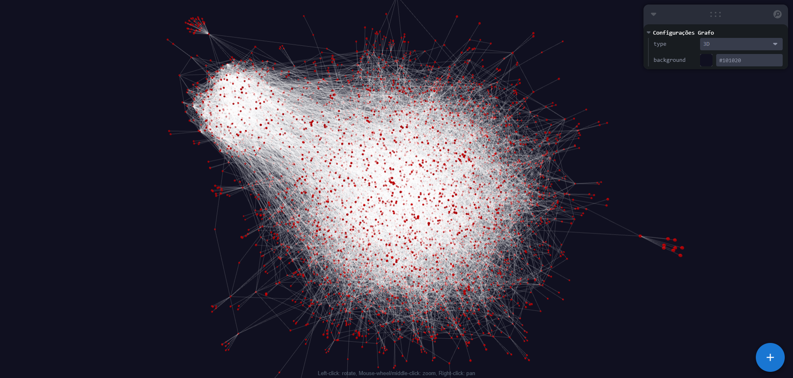
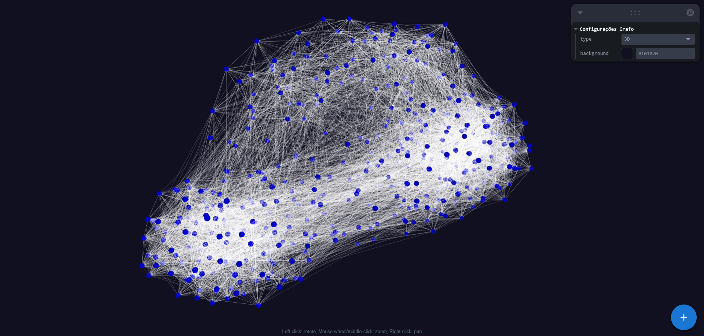

# Ferramenta Interativa Web para Visualização de Grafos

> Neste trabalho foi empregada a tecnologia React e TypeScript. Utilizando as bibliotecas React Force Graph para plotar o grafo e Material UI para montar o layout.

Disponível para 📱 mobile e 💻 desktop em: [https://diogoleite87.github.io/graphview-social-media/](https://diogoleite87.github.io/graphview-social-media/)

## Objetivo

### Este trabalho tem como objetivo construir uma ferramenta para visualização de grafos, decorrente de uma demanda da disciplina Análise de Midias Sociais durante minha graduação em Sistemas de Informação - UFOP.

## Importar Grafos



### Podemos importar qualquer grafo desde que ele atenda o seguinte modelo e estrutura:

#### ⚠️ A densidade do grafo está diretamente relacionada ao poder computacional disponível. Quanto maior a densidade do grafo, ou seja, quanto mais nós e arestas ele contiver, maior será o processamento necessário.

### Modelo Json

```json
{
  "nodes": [], // array de nós
  "links": [] // array de arestas
}
```

### Nós

```json
{
  "id": string, // id unico
  "name": string, // nome do nó (sera exibido quando mover cursor por cima do nó)
  "label": string, // rotulo do nó
  "color": string // opcional (cor do nó)
}
```

### Arestas

```json
{
    "source": string, // id do nó de origem
    "target": string, // id do nó de destino
    "label": string, // rotulo da aresta
    "color": string // opcional (cor da aresta)
}
```

### Exemplo do modelo Json de importação

### Modelo Json

```json
{
  "nodes": [
    {
      "id": "node1",
      "name": "Nó 1",
      "label": "Primeiro Nó",
      "color": "blue"
    },
    {
      "id": "node2",
      "name": "Nó 2",
      "label": "Segundo Nó",
      "color": "red"
    },
    {
      "id": "node3",
      "name": "Nó 3",
      "label": "Terceiro Nó",
      "color": "green"
    }
  ],
  "links": [
    {
      "source": "node1",
      "target": "node2",
      "label": "Link 1",
      "color": "purple"
    },
    {
      "source": "node2",
      "target": "node3",
      "label": "Link 2",
      "color": "orange"
    },
    {
      "source": "node3",
      "target": "node1",
      "label": "Link 3",
      "color": "yellow"
    }
  ]
}
```

### Resultado da importação



## Modelos Prontos de Grafos

### Acessando a opção "Utilizar Template" no Menu localizado no canto inferior direito, se encontra diversas modelos de grafos prontos para importar.



### Análise das Conexões Políticas no Twitter: Quem Segue Quem?

#### Base da dados coletada do Twitter com Web Scraping: [Repositório](https://github.com/diogoleite87/crawler-twitter-graph).



### Rede peer-to-peer Gnutella

#### Disponível em: [Clique aqui](http://snap.stanford.edu/data/p2p-Gnutella08.html).



### Rede de Interação no Twitter para o Congresso dos Estados Unidos

#### Disponível em: [Clique aqui](http://snap.stanford.edu/data/congress-twitter.html)


